

## Laporan Pemrogaman WEB Lanjut Jobsheet 5 Blade View, Web Templating(AdminLTE), Datatables

## Politeknik Negeri Malang 
## Semester 4 
##2025

**NIM:** 241720099

**Nama:** M. Firmansyah

**Kelas:** 2A

**Jurusan:** Teknologi Informasi

**Program Studi:** D-IV Teknik Informatika

**Praktikum** **1** **–** **Integrasi** **Laravel** **dengan**
**AdminLte3**

> 1\. Q: Dalam root folder project lakukan command berikut, untuk mendefinisikan requirement project.
>
> A:
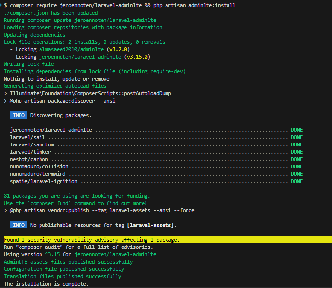

> 2\. Q: Melakukan instalasi requirement project di atas dengan command
> berikut:
>
> A:

> 
3. Q: Kembali ke browser, menuju ke halaman awal. 
> A:
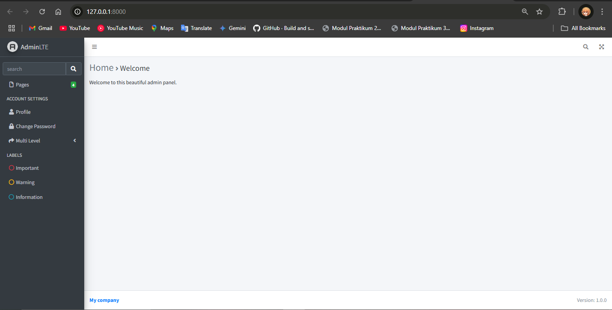

**Praktikum** **2** **–** **Integrasi** **dengan** **DataTables**

> 1\. Q : “Install Laravel DataTables composer require laravel/ui --dev
> composer require yajra/laravel-datatables:^10.0
>
> A:
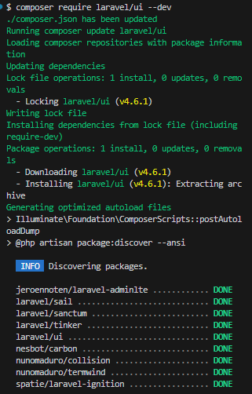
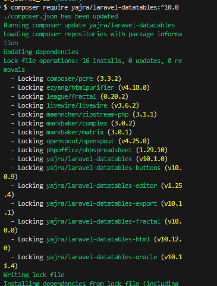

>
> 2\. Q: Install Laravel
> DataTables Vite dan sass 
>
> A:
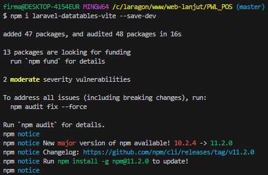 style="width:4.89861in;height:2.04653in" />
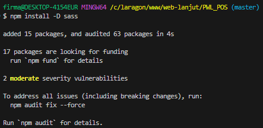 style="width:4.89861in;height:2.04653in" />

> 3\. Q: Jalankan dengan npm run dev
>
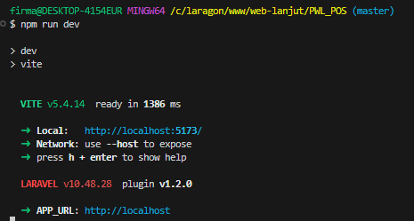

> 4\. Q: Datatables sudah
> dapat di load di /kategori
>
>A:
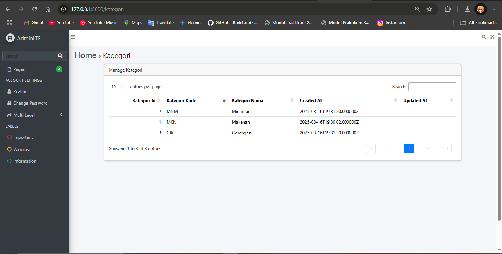

**Praktikum** **3** **–** **Membuat** **form** **kemudian**
**menyimpan** **data** **dalam** **database**

> 1\. Q: Akses kategori/create 
>
A:
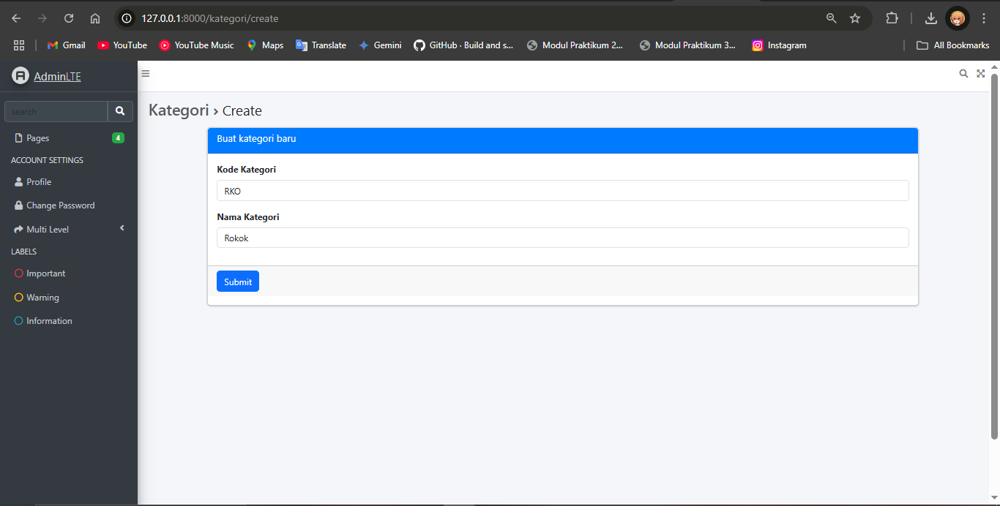

> 2. Q: Halaman kategori
>
>A:
 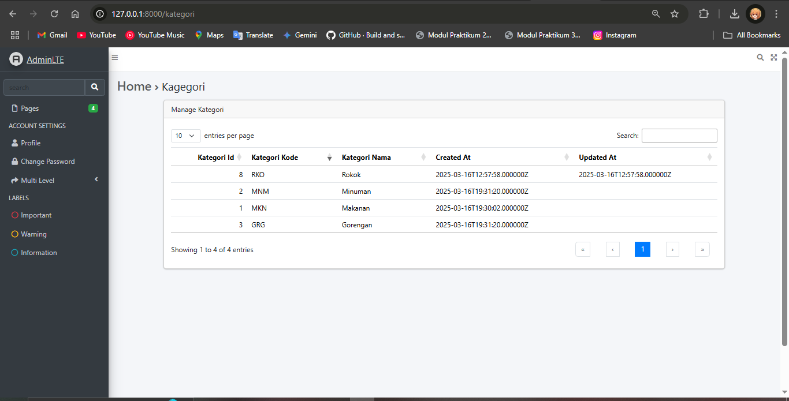

**Tugas**

> 1. Q: Tambahkan button Add
> di halam manage kategori, yang mengarah ke create kategori baru 
>
>A:
> Edit kode pada kategori\idex.blade.php
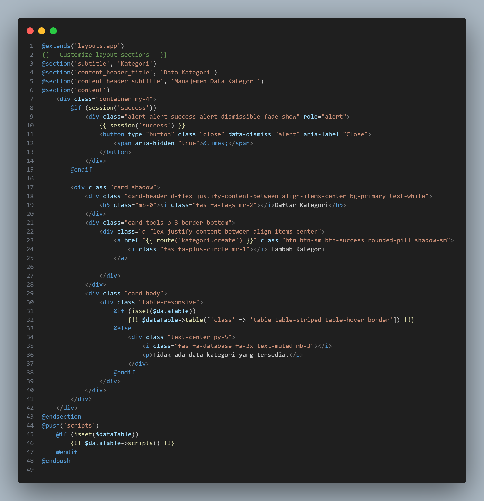

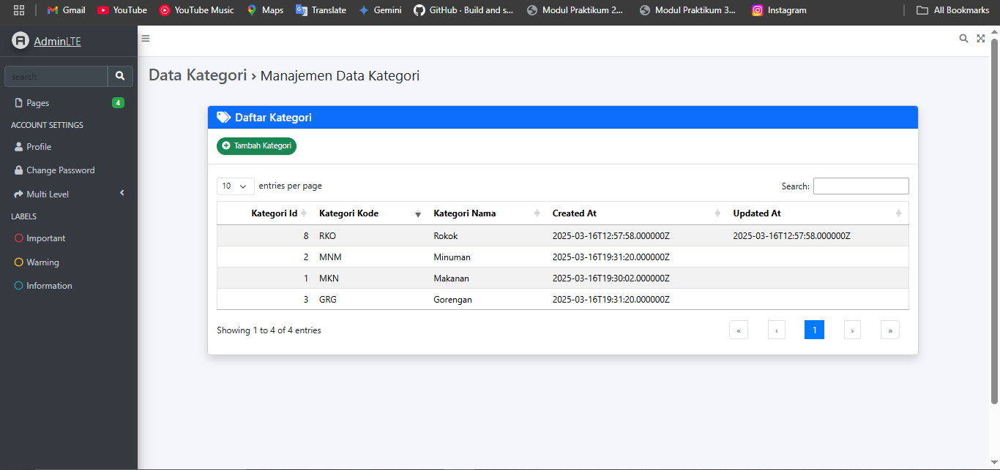

> 2. Q: Tambahkan menu untuk
> halaman manage kategori, di daftar menu side bar 
>
>A: Tambahkan kode berikut pada config\adminlte.php
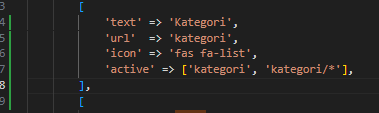
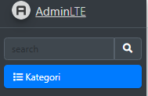

> 3\. Q: Tambahkan action edit di datatables dan buat halaman edit serta controllernya 
>A: Tambahkan route ada web.php Tambahkan kode ini pada KategoriDatatables:
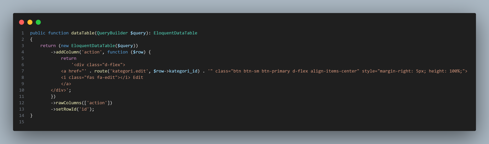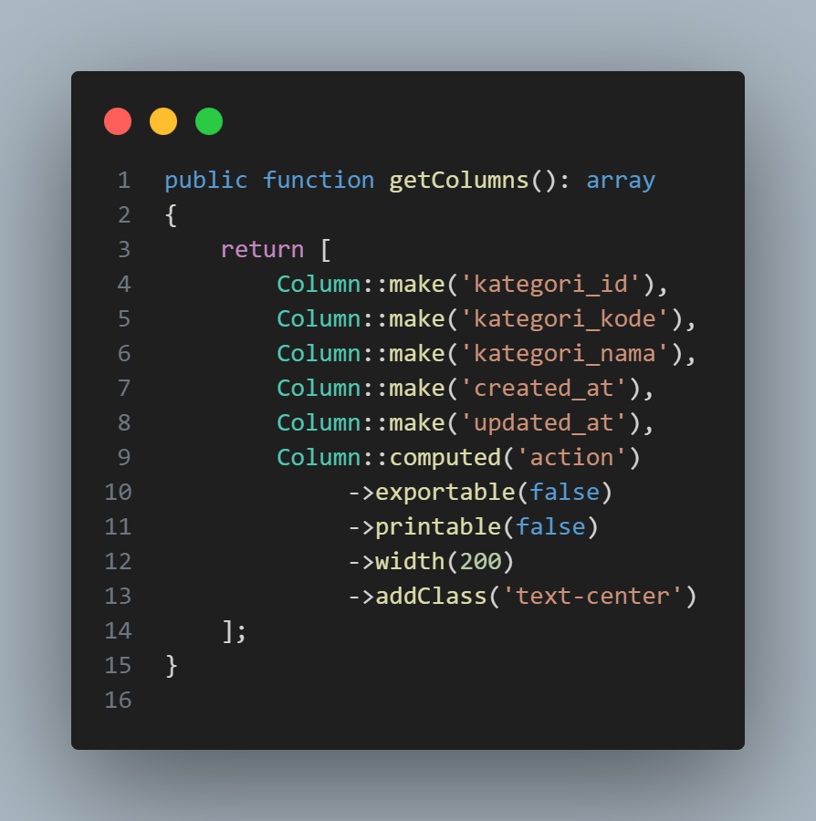

>Tambahkan kode ini pada kategoriController.
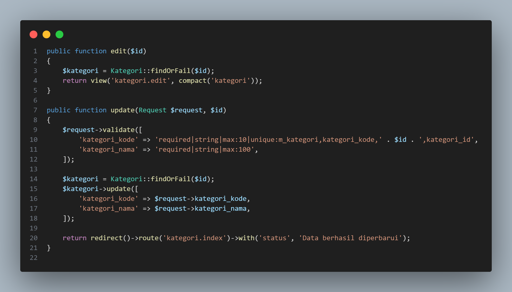

>Kategori/edit
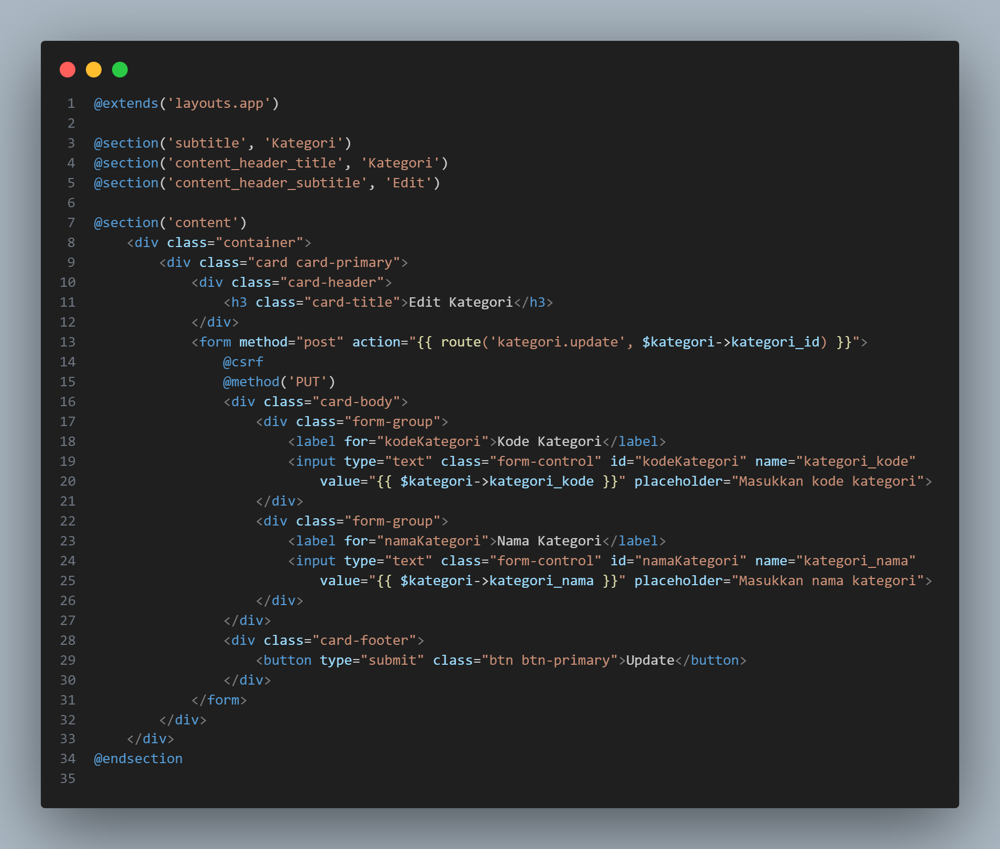
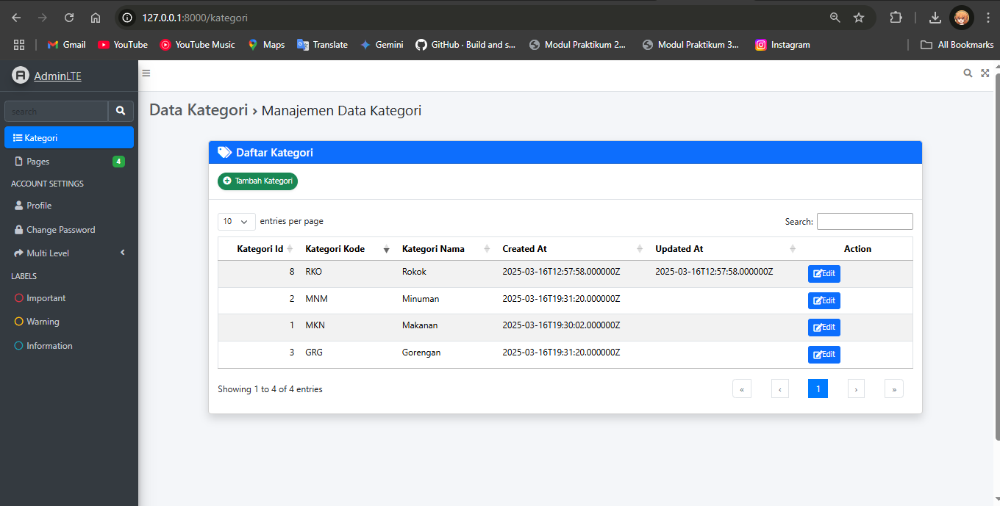

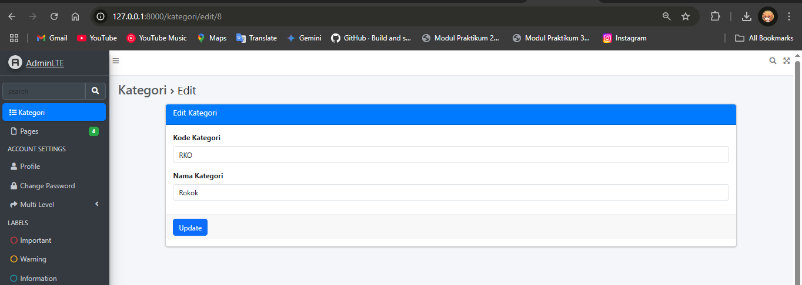

> 4\. Q: Tambahkan action delete di datatables serta controllernya 
>A: tambahkan route pada web. Kemudian edit kategoriController.php
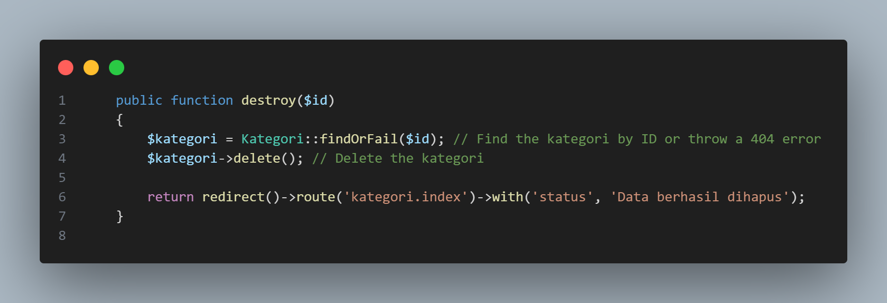

>Dan tambahkan kode pada kategori datatable
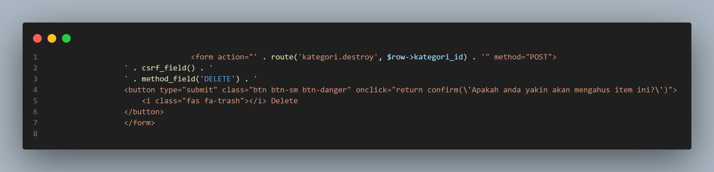
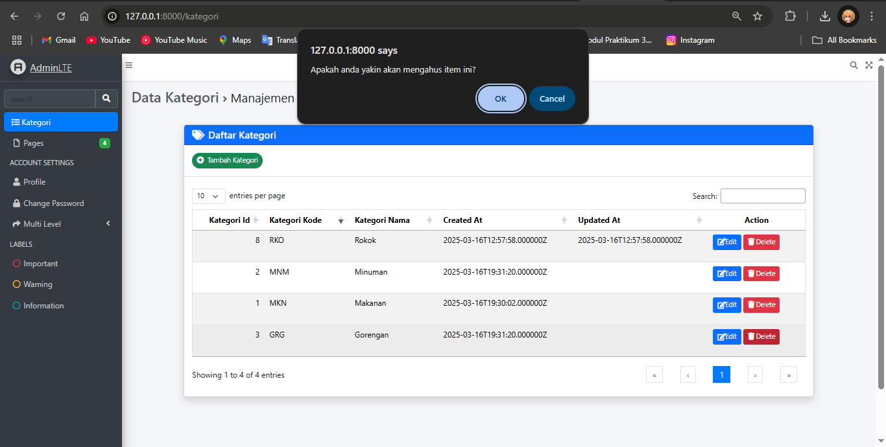>